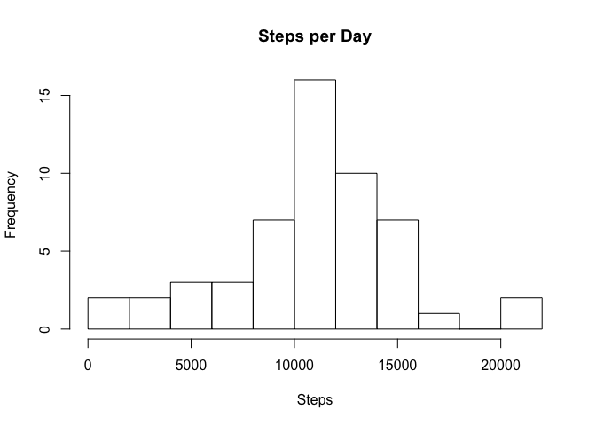
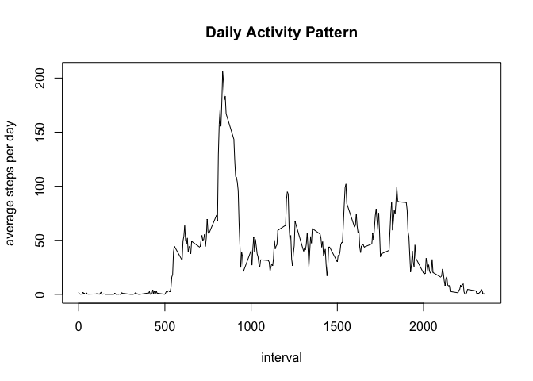
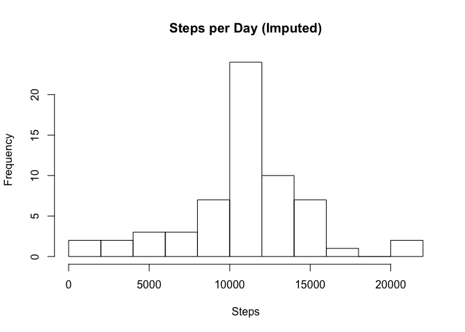
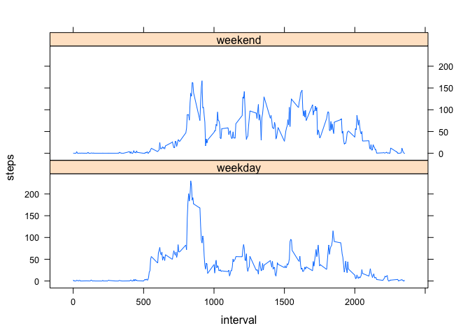

# Reproducible Research: Peer Assessment 1


## Loading and preprocessing the data

```r
unzip("activity.zip")
activity <- read.csv("activity.csv")

#aggregate the steps per day
steps_per_day <- aggregate(steps ~ date, activity, sum)
hist(steps_per_day$steps, breaks=10, xlab="Steps", main="Steps per Day")
```

 


## What is mean total number of steps taken per day?

```r
mean_steps <- mean(steps_per_day$steps)
median_steps <- median(steps_per_day$steps)
```
The mean number of steps is 1.0766189\times 10^{4}.  
The median number of steps is 10765.

## What is the average daily activity pattern?

```r
#aggregate the steps per interval
average_steps_per_interval <- aggregate(steps ~ interval, activity, mean)

plot(average_steps_per_interval$interval, 
     average_steps_per_interval$steps, type="l", 
     xlab="interval", 
     ylab="average steps per day", 
     main="Daily Activity Pattern")
```

 

```r
#find the interval with the maximum number of steps
maximum_interval <- average_steps_per_interval[which.max(average_steps_per_interval$steps),1]
```
The interval with the maximum number of steps is: 835.

## Imputing missing values

```r
missing_data_count <- nrow(activity[is.na(activity$steps),])

activity_i <- activity
# replace NA values in the steps column with the average steps per interval for the
# given interval, rounded to the nearest integer.
activity_i[is.na(activity_i$steps),]$steps <- 
    sapply(activity_i[is.na(activity_i$steps),]$interval, 
           FUN=function(x){ 
               round(average_steps_per_interval[which(average_steps_per_interval$interval == x), 2],0)
               })

#aggregate the steps per day
steps_per_day_i <- aggregate(steps ~ date, activity_i, sum)
hist(steps_per_day_i$steps, breaks=10, xlab="Steps", main="Steps per Day (Imputed)")
```

 

```r
mean_steps_i <- mean(steps_per_day_i$steps)
median_steps_i <- median(steps_per_day_i$steps)
```
There are 2304 records that are missing step data.

The mean number of steps is 1.0765639\times 10^{4} after imputing the data (original mean: 1.0766189\times 10^{4}).  
The median number of steps is 1.0762\times 10^{4} after imputing the data (original median: 10765).  

## Are there differences in activity patterns between weekdays and weekends?

```r
library(lattice)
# calculate the weekend/weekday value for each date
activity_i$weekday <- 
    sapply(activity_i$date, 
           function(x) { 
               if(weekdays(as.Date(x)) %in% c("Saturday", "Sunday")) "weekend" else "weekday"
               })

activity_i <- transform(activity_i, factor(weekday))

# calucate mean steps per interval by weekday/weekend
steps_per_interval_i_w <- aggregate(steps ~ interval+weekday, activity_i, mean)
p <- xyplot(steps ~ interval | weekday, 
            data = steps_per_interval_i_w, 
            layout = c(1, 2), 
            type="l")
print(p)
```

 
